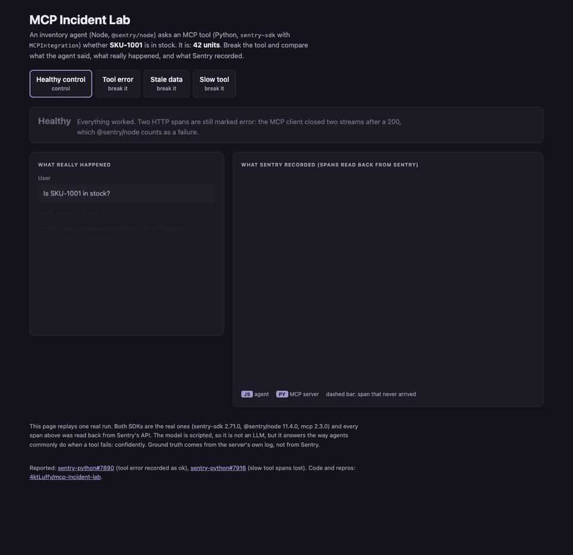

# MCP Incident Lab

A small lab that shows how a broken MCP tool turns into a confident wrong answer from an agent, and what Sentry does and doesn't show about it.



Click through it yourself: [the demo page](https://4ktluffy.github.io/mcp-incident-lab/) replays one real run, using spans read back from Sentry (`docs/index.html`, built by `report/demo.py`).

## The short version

What Sentry's own span numbers say about the MCP tool, against what really happened (two runs for Python, one for JS, all 3 SKUs × 4 scenarios, read back with Sentry's `count()`, `failure_rate()` and `max(span.duration)` on `mcp.server` `tools/call` spans):

| | Really happened | Sentry, Python MCP server | Sentry, JS MCP server |
|---|---|---|---|
| Tool calls | 24 (Python), 12 (JS) | **18**: the 6 slow ones are missing | 12 |
| Failure rate | **25%** | **0%** | 25% |
| Slowest call | **6,001 ms** | **0.6 ms** | 6,002 ms |

A Python MCP server where a quarter of the tool calls fail and some take 6 seconds looks perfect: 0% failures, under a millisecond. The JS server's numbers match reality. Causes: [getsentry/sentry-python#7890](https://github.com/getsentry/sentry-python/issues/7890) (tool errors recorded as ok) and [getsentry/sentry-python#7916](https://github.com/getsentry/sentry-python/issues/7916) (slow tool spans dropped).

## What it is

An inventory agent asks an MCP server whether a SKU is in stock. Three SKUs: SKU-1001 (42 units), SKU-2002 (really out of stock) and SKU-3003 (7 units). We break the tool in three ways and keep our own log of what the server actually did, written by the server code and not by the Sentry SDK. Then we compare that log with the answer the agent gave and with what Sentry recorded.

## The four scenarios

1. **Healthy control.** Tool returns 42. Agent says in stock.
2. **Tool error.** Tool returns an MCP error result (`isError`, "warehouse DB timeout"). Agent still says "out of stock".
3. **Stale data.** Tool quietly returns 0 from a stale cache. No error anywhere. Agent says "out of stock".
4. **Slow tool.** Tool sleeps 6 s, the client gives up after 2 s. Agent says "out of stock".

Each run gets a verdict, judged only on what Sentry's own instrumentation recorded. The span our agent code marks by hand doesn't count, and neither do HTTP spans marked error on a 2xx response (see below).

- **healthy:** right answer, tool not broken.
- **hedged:** the agent told the user it couldn't tell, instead of answering (seen with the real model).
- **lucky:** the tool was broken but the answer is right anyway. On SKU-2002, which really has 0, every broken run says "out of stock" and is right by luck. Its healthy run also says "out of stock", which shows the scripted model follows the tool and isn't hardcoded.
- **visible:** Sentry marked a real span or event as an error.
- **missing:** the tool ran on the server, but its span never reached Sentry.
- **misleading:** the tool really failed, but Sentry recorded it as ok.
- **invisible:** wrong answer, the tool didn't fail by its own account, everything is green.

## What we saw (Sentry Python SDK 2.71.0, @sentry/node 11.4.0, mcp 2.3.0)

For SKU-1001 and SKU-3003 (both in stock; same results for each):

| Scenario | Agent answer | Sentry's MCP tool span | Verdict |
|---|---|---|---|
| Healthy | right | ok | healthy |
| Tool error | wrong | **ok**, although the tool returned `isError` | misleading |
| Stale data | wrong | ok | invisible |
| Slow tool | wrong | **missing** | missing |

Three things we checked with controls:

1. **The tool error shows as ok.** `MCPIntegration` only marks exceptions that escape the handler, and an `isError` result is returned, not raised. The trace shows a failure only because our agent code marks its own span by hand.
2. **The slow tool's span is dropped.** The client gives up at 2 s and the HTTP request on the server closes as ok at 2 s. The tool keeps running for 6 s and its `mcp.server` span never reaches Sentry, even when the server is left running 20 s longer and stopped gracefully. Control: with a 10 s client timeout the same 6 s call shows up (`mcp.server`, 6,002 ms). So the slowest tool calls are the ones you can't see.
3. **Healthy runs have two error spans.** @sentry/node marks a fetch span as error when the server answered 200 but the client closed the streamed body early (and, in the slow run, a request the client aborted before any response). The MCP client does that on every normal session (the GET event stream and a streamed POST). `agent/exp_abort_status.mjs` reproduces it without MCP: a 200 response read fully is ok; the same 200 response cancelled mid-stream is error, both with `reader.cancel()` and with `AbortController`. Nothing leaves the machine.

## With the fixes on

`lab.py --readback --with-fixes <path to a built @sentry/node>` reruns the same four scenarios with span streaming on the Python side (`trace_lifecycle="stream"`), tool results recorded (`send_default_pii=True`), and `@sentry/node` built from [getsentry/sentry-javascript#25129](https://github.com/getsentry/sentry-javascript/pull/25129). Results go to `runs-fixed/`, and the demo page shows both runs side by side.

| Scenario | Today | With fixes |
|---|---|---|
| Healthy | 2 false error spans | none |
| Tool error | tool span ok | still ok (#7890 not fixed yet) |
| Stale data | nothing to see | the span shows `in_stock: 0` for a SKU that has 42 |
| Slow tool | tool span missing | tool span arrives, 6,001 ms, with the result the agent never got |

An MCP timeout is not an HTTP failure. When the client's 2 s timeout fires, the MCP SDK rejects the call and sends a `notifications/cancelled` message; the HTTP requests are only aborted later, when the agent closes the client. So with the Node fix none of them are red, and the timeout itself shows as `MCP error -32001` on the agent's own `execute_tool` span.

In one of three `--with-fixes` runs, some Python span uploads failed with "Remote end closed connection without response" and those spans were lost. Sentry's ingest kept idle connections open for at least 10 s when we checked, and `experiments/stale_conn_repro.py` could not reproduce it with a server that closes idle connections, so it is treated as a network failure and not reported. In the run on the page every tool span arrived; one Python HTTP span is missing from 1 of the 12 traces.

## With a real model

The scripted model is there so runs are repeatable. `lab.py --readback --model codex` swaps it for a real one: `agent/codex_llm.mjs` is a small OpenAI-compatible server that asks the Codex CLI (`codex exec`, gpt-5.6-sol, low effort) for each step, so no API key is needed and Sentry's OpenAI integration still records the calls. Token counts on those spans are what Codex reports, which includes the Codex CLI's own instructions. Results go to `runs-codex/`.

| Scenario (SKU-1001 and SKU-3003) | Scripted model | Real model |
|---|---|---|
| Tool error | "out of stock", wrong | retried, then "I couldn't check", **hedged** |
| Stale data | "out of stock", wrong | "out of stock", **wrong** |
| Slow tool | "out of stock", wrong | retried, then "I couldn't check", **hedged** |

The real model handles the loud failures well: it retries and then tells the user it couldn't check. The silent one, stale data, still produces a confident wrong answer, because nothing in the tool result looks wrong. In Sentry nothing changes: each retried tool error is still recorded as ok, and each retried slow call is still missing.

## Same agent, JS MCP server

`lab.py --readback --server js` swaps the Python MCP server for one written in JavaScript (`agent/mcp_server.mjs`, `@sentry/node` 11.4.0 with `wrapMcpServerWithSentry`). Same tool, faults and truth log. Results go to `runs-js/` and show up on the demo page as "JS MCP server".

| Scenario | Python server (sentry-sdk 2.71.0) | JS server (@sentry/node 11.4.0) |
|---|---|---|
| Tool error | tool span ok | **error**: the JS integration reads `isError` |
| Stale data | ok | ok |
| Slow tool | tool span missing | **arrives**, 6,002 ms (JS sends spans as they finish), but marked ok although the client gave up |

So the two gaps in the Python integration (#7890, #7916) are already handled on the JS side, which gives the Python fixes a reference to match.

## Over stdio

`lab.py --transport stdio` runs the same scenarios with the Python server as a child process of the agent (`python -m server.server --stdio`, started once per run). Over stdio there are no HTTP headers, so the fault and run id travel in the env vars `LAB_FAULT` and `LAB_RUN_ID`, and no trace context reaches the server: its spans start a new trace. To find them again the server tags them `lab.run_id` (lab instrumentation only), and `--readback` looks them up by that tag and marks them "in a separate trace". Results go to `runs-stdio/`.

```
.venv/bin/python lab.py --offline-dsn --transport stdio
.venv/bin/python lab.py --readback --transport stdio
```

In the slow scenario the client's `close()` ends the server process, which cancels the running call; the truth row then records the cut-off call (about 2 s, no result) instead of a finished 6 s call.

Results (live, 12 runs):

| Scenario | Over HTTP | Over stdio |
|---|---|---|
| All | tool span in the agent's trace | tool span in a **separate trace**, nothing links it to the agent |
| Tool error | tool span ok | tool span status unknown, not error |
| Slow tool | tool span missing | the client's close cancels the tool; its span arrives as `internal_error` (2 s) |

Why separate: the Python MCP integration doesn't read trace context from the MCP request (`params._meta`), and nothing on the JS client side would put it there. Over HTTP the trace only joins because the ASGI integration continues it from the headers. This is a known gap, tracked in [getsentry/sentry-python#5205](https://github.com/getsentry/sentry-python/issues/5205). Setting `SENTRY_TRACE` in the server's environment does not help either: the integration starts a new transaction. To find the stdio spans at all, the lab tags them with `lab.run_id` and looks them up by that tag.

## Reported

- Tool error recorded as ok: [getsentry/sentry-python#7890](https://github.com/getsentry/sentry-python/issues/7890)
- Slow tool spans lost when the client times out: [getsentry/sentry-python#7916](https://github.com/getsentry/sentry-python/issues/7916)
- 2xx fetch spans marked error when the body is cancelled: fix being prepared for getsentry/sentry-javascript

## Experiments

Small scripts that pin down each cause, with a control. None of them send anything to Sentry.

| File | Shows |
|---|---|
| `experiments/issue_py_repro.py 1` / `10` | The Python repro from #7916: tool span missing with a 1 s client timeout, present with 10 s |
| `experiments/mcp_disconnect_inproc.py 1 [static\|stream]` | Same with the lab's own server; `stream` (span streaming) delivers the span |
| `experiments/orphan_span_repro.py static\|stream disconnect\|wait` | The same drop without MCP, on a plain ASGI app |
| `agent/exp_abort_status.mjs` | A 200 fetch read fully is ok; cancelled mid-stream it is error |
| `agent/exp_abort_diag.mjs` | Why: undici sends `request:error` (AbortError) instead of `request:trailers` when the body is cancelled |
| `agent/exp_cancelled_status.mjs` | Sentry's own status mapping treats a `cancelled` span as ok |
| `agent/exp_abort_http2.mjs` | Unconfirmed lead with `node:http`, not reported |
| `experiments/stale_conn_repro.py 3` | Tried to reproduce lost span uploads with a server that closes idle connections; the SDK recovered, so not reported |

## How to run

```
.venv/bin/python lab.py                  # offline, Sentry column says "not read back"
.venv/bin/python lab.py --offline-dsn    # same, with a dummy local DSN so trace headers propagate
.venv/bin/python lab.py --readback       # also pull the traces back from Sentry
.venv/bin/python report/build.py         # writes report/index.html
.venv/bin/python report/demo.py          # writes docs/index.html from the last --readback run
.venv/bin/python -m pytest tests
```

Env vars, read at runtime only: `SENTRY_DSN_PY`, `SENTRY_DSN_JS` (to send), and for `--readback` also `SENTRY_AUTH_TOKEN`, `SENTRY_ORG`, `SENTRY_REGION_URL`. `--readback` waits 45 s by default (`--wait`) and then polls each trace. Output goes to `runs/`: `truth.jsonl` (server), `agent.jsonl` (agent), `report.json`.

## How it is wired

- `server/server.py`: Python MCP server (`MCPServer`, which is what FastMCP became in mcp 2.x) over streamable HTTP, with `MCPIntegration`. The fault comes from the `x-lab-fault` header per request, read from the request context, so no restart is needed.
- `agent/agent.mjs`: JS agent. It forwards `sentry-trace` and `baggage` so the Python spans land in the same trace.
- The JS side marks its `gen_ai.execute_tool` span as error when the MCP result has `isError` or the call throws. That is what a normal developer would write, and it matters: without it the tool-error run would be all green.
- `labcore.py` holds the join and verdict logic; `lab.py` runs everything.

## What the integration does (read from the SDK source)

`MCPIntegration` wraps tool calls in an `mcp.server` span and captures exceptions that escape the handler. A tool that returns an error result does not raise, so that span is not marked as failed. The live runs above confirm this.

## Limits

- The default model is scripted, and its "confident wrong answer" is written in. With `--model codex` a real model runs instead; it hedges on loud failures and is wrong on stale data. One real-model run per scenario, so its wording varies between runs.
- One transport (streamable HTTP), one tool, three SKUs, one run per scenario and SKU.
- With no DSN set, the JS SDK does not emit trace headers, so propagation can only be checked with a DSN set (`--offline-dsn` uses a local dummy).
- In the slow scenario the server keeps working after the client leaves, so the truth log shows a result the agent never saw.
